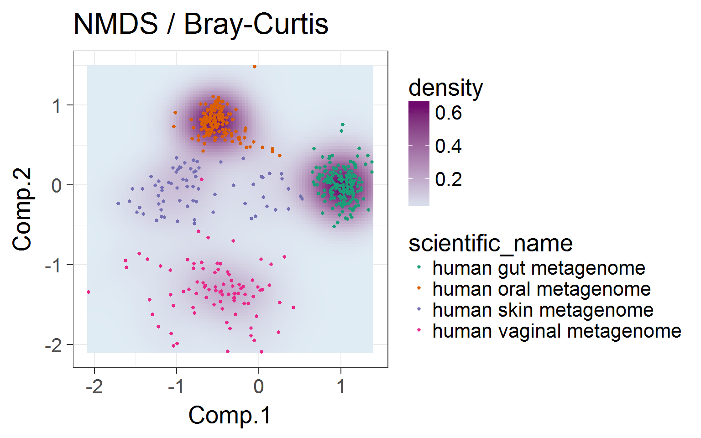

---
title: "OPEN & REPRODUCIBLE MICROBIOME DATA ANALYSIS SUMMER SCHOOL"  
author: "MolEco WUR"  
---

Wageningen, The Netherlands, May 28-30, 2018     
======================================================

Microbiome R package {.sidebar}
-----------------------------------------------------------------------

 

Gallery  {.tabset .tabset-fade}
-----------------------------------------------------------------------  

During the course, we will go through the theory, concepts, and open source R tools for conducting and interpreting these and other related analyses that belong to the standard toolkit in microbial bioinformatics.  

The following visualisations were created using the [Human microbiome project phase I data](https://www.ncbi.nlm.nih.gov/pubmed/22699609). The 16S rRNA gene variable region sequenced here is V1-V3. The raw reads were processed using QIIME 1.9.1, SortMeRNA, and OTU picking was done using the Closed-reference OTU-picking at 97% identity. We acknowledge the effort of the authors of Human microbiome project phase I for making the data freely available.  

### Prevalence  

   

### Composition barplot 

   

### Composition heatmap   

   

### Core microbiota    

   

### Alpha diversity  

   

### Population-level-density  

   

### Ordination   

   

### Network inference     

   

-----------------------------------------------------------

# Organisers  

  

